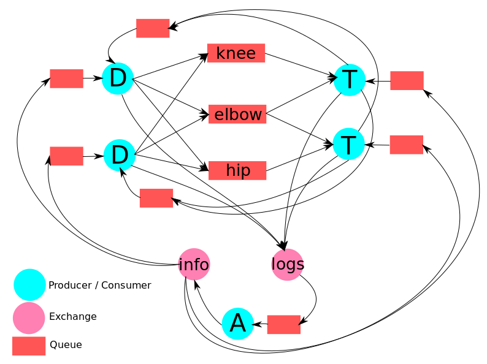

# med-rabbit

[RabbitMQ] university task written with [Node.js].
App serves a hospital orthopedic ward.

Roles in app:
- Doctor - delegates tasks, receive results
- Technician - makes med examination, sends results
- Admin - logs whole activity, sends messages to everybody

The hospital accepts patients with hip, elbow, or knee injury.

Doctor delegates task to any technician who can make examination. Doctor sends information about kind of injury (knee / elbow / hip) and surname of patient (e.g. hip Doe). Results are received asynchronously.

Every Technician can make 2 kinds of examination (e.g. hip and elbow). Technicians skills are given  as arguments. Technician receives task, make examination and sends back results to Doctor. Every task is done by exactly one technician, but not always by the same one.

Admin gets copy of every message and can send info to every doctor and technician.

# Communication scheme


# Example test
Run npm install and make sure RabbitMQ server is running.
```sh
$ ./admin
$ ./doctor
$ ./doctor
$ ./technician hip elbow
$ ./technician hip knee
```
Now you can try to send some messages as admin or delegate some tasks as one of doctors.


Error handling was not provided.

   [RabbitMQ]: <https://www.rabbitmq.com/>
   [Node.js]: <http://nodejs.org>

